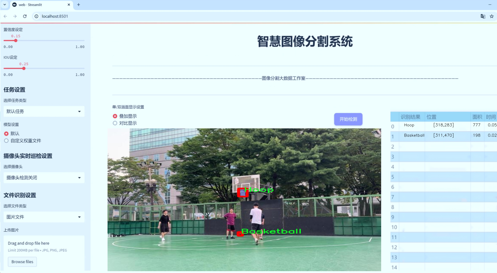
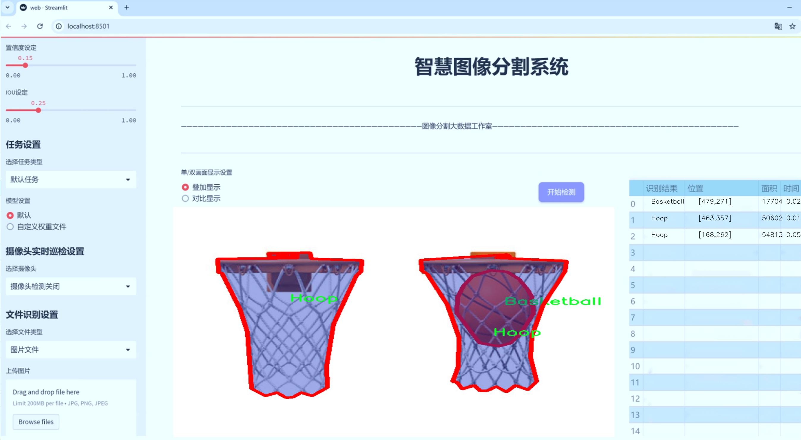
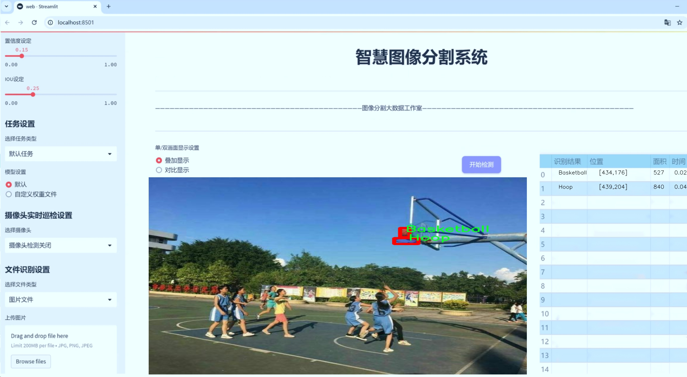
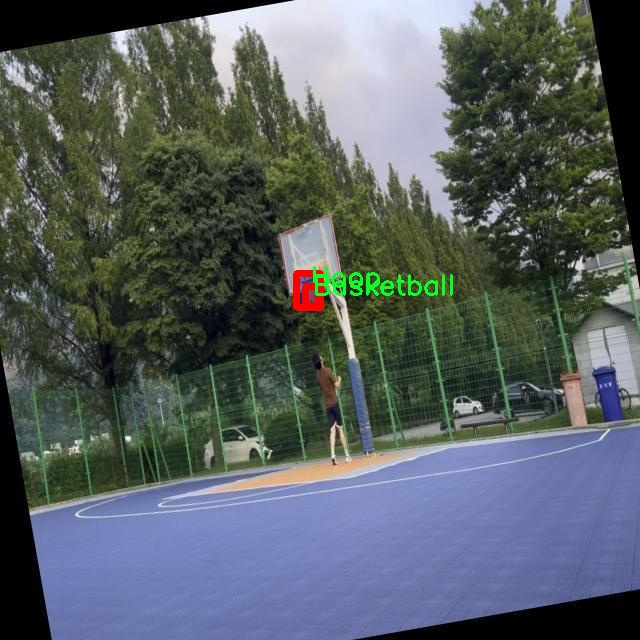
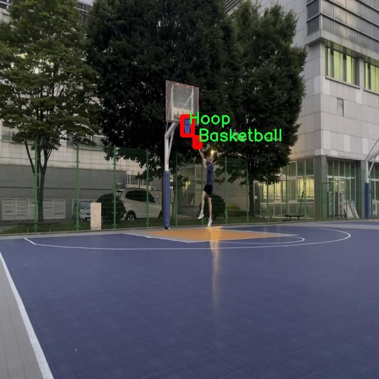
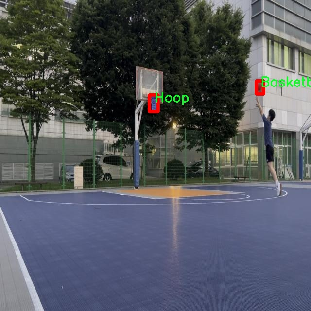
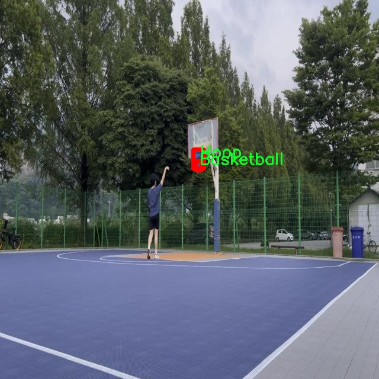
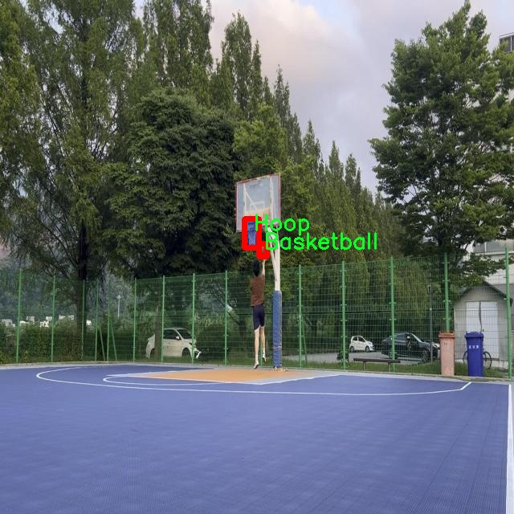

# 篮球场景分割系统源码＆数据集分享
 [yolov8-seg-AFPN-P345＆yolov8-seg-convnextv2等50+全套改进创新点发刊_一键训练教程_Web前端展示]

### 1.研究背景与意义

项目参考[ILSVRC ImageNet Large Scale Visual Recognition Challenge](https://gitee.com/YOLOv8_YOLOv11_Segmentation_Studio/projects)

项目来源[AAAI Global Al lnnovation Contest](https://kdocs.cn/l/cszuIiCKVNis)

研究背景与意义

随着计算机视觉技术的迅猛发展，深度学习在图像处理领域的应用日益广泛，尤其是在目标检测和实例分割任务中。篮球作为一项全球广受欢迎的运动，其比赛场景中的动态元素复杂多变，给计算机视觉的研究带来了新的挑战。传统的篮球场景分析方法往往依赖于手工特征提取和规则设定，难以适应多变的环境和复杂的运动状态。因此，基于深度学习的自动化场景分割系统的研究显得尤为重要。

本研究旨在构建一个基于改进YOLOv8的篮球场景分割系统，利用现有的篮球和篮筐数据集，推动篮球比赛分析的智能化和自动化。该数据集包含2600张图像，涵盖了四个主要类别：后板、篮球、篮筐和球员。这些类别的细致划分为我们提供了丰富的训练数据，使得模型能够在不同的场景下进行有效的实例分割。尤其是在比赛过程中，球员的动态动作、篮球的飞行轨迹以及篮筐的相对位置都需要被准确识别和分割，以便进行后续的战术分析和比赛策略优化。

YOLO（You Only Look Once）系列模型因其高效的实时检测能力而广受欢迎。YOLOv8作为该系列的最新版本，在速度和精度上均有显著提升。通过对YOLOv8模型的改进，我们可以更好地适应篮球场景的特点，提升实例分割的准确性和鲁棒性。具体而言，改进可以体现在网络结构的优化、损失函数的调整以及数据增强策略的应用等方面。这些改进将使得模型在复杂背景下仍能准确识别和分割目标，为篮球比赛的实时分析提供强有力的支持。

在实际应用中，基于该系统的篮球场景分割技术不仅可以用于比赛视频的实时分析，还可以为教练和运动员提供战术指导和技术反馈。通过对比赛数据的深入分析，教练可以更好地理解球员的表现，制定针对性的训练计划。同时，运动员也可以通过数据反馈，提升自身的技术水平，优化比赛策略。此外，该系统还可以为体育科研提供数据支持，推动篮球运动的科学化发展。

综上所述，基于改进YOLOv8的篮球场景分割系统的研究，不仅具有重要的学术价值，也具备广泛的应用前景。通过深入探索篮球场景中的目标检测与实例分割技术，我们能够为篮球运动的智能化发展贡献新的思路和方法，推动体育科技的进步。希望本研究能够为未来的相关研究提供借鉴，并为篮球运动的进一步发展奠定基础。

### 2.图片演示







##### 注意：由于此博客编辑较早，上面“2.图片演示”和“3.视频演示”展示的系统图片或者视频可能为老版本，新版本在老版本的基础上升级如下：（实际效果以升级的新版本为准）

  （1）适配了YOLOV8的“目标检测”模型和“实例分割”模型，通过加载相应的权重（.pt）文件即可自适应加载模型。

  （2）支持“图片识别”、“视频识别”、“摄像头实时识别”三种识别模式。

  （3）支持“图片识别”、“视频识别”、“摄像头实时识别”三种识别结果保存导出，解决手动导出（容易卡顿出现爆内存）存在的问题，识别完自动保存结果并导出到tempDir中。

  （4）支持Web前端系统中的标题、背景图等自定义修改，后面提供修改教程。

  另外本项目提供训练的数据集和训练教程,暂不提供权重文件（best.pt）,需要您按照教程进行训练后实现图片演示和Web前端界面演示的效果。

### 3.视频演示

[3.1 视频演示](https://www.bilibili.com/video/BV1ePDdYLEoL/)

### 4.数据集信息展示

##### 4.1 本项目数据集详细数据（类别数＆类别名）

nc: 4
names: ['Backboard', 'Basketball', 'Hoop', 'Player']


##### 4.2 本项目数据集信息介绍

数据集信息展示

在本研究中，我们使用了名为“basketball-and-hoop”的数据集，以训练和改进YOLOv8-seg模型，旨在实现高效的篮球场景分割。该数据集专注于篮球场景的多个关键元素，包含四个主要类别，分别是“Backboard”（篮板）、“Basketball”（篮球）、“Hoop”（篮筐）和“Player”（球员）。这些类别的选择不仅反映了篮球比赛的基本构成要素，也为模型的训练提供了丰富的语义信息，能够帮助系统更好地理解和识别场景中的重要元素。

“basketball-and-hoop”数据集的构建过程经过精心设计，确保了数据的多样性和代表性。数据集中包含了大量不同场景下的篮球图像，包括室内和室外的篮球场、不同时间和天气条件下的比赛画面，以及各种角度和距离的拍摄。这种多样性使得模型在训练过程中能够学习到更为广泛的特征，从而提升其在实际应用中的鲁棒性和准确性。

在数据标注方面，数据集中的每个类别都经过精确的标注，确保了每个元素在图像中的位置和形状都能被准确识别。比如，篮板的边缘、篮球的轮廓、篮筐的结构以及球员的姿态等，都被清晰地标注出来。这种细致的标注方式不仅有助于提高模型的分割精度，也为后续的模型评估提供了可靠的基准。

为了确保模型的训练效果，我们在数据集中采用了多种数据增强技术，包括随机裁剪、旋转、缩放、颜色变换等。这些技术能够有效增加训练样本的多样性，减少模型对特定图像特征的过拟合，从而提升其在新场景中的泛化能力。此外，数据集还包括了不同类型的篮球比赛场景，如职业联赛、业余比赛等，使得模型能够适应不同的应用场景。

在模型训练过程中，我们将“basketball-and-hoop”数据集与YOLOv8-seg模型相结合，利用其先进的深度学习架构，进行端到端的训练。通过对数据集的反复迭代训练，模型逐渐学习到了如何在复杂的篮球场景中准确分割出各个类别的对象。这一过程不仅提高了模型的分割精度，也为后续的实时应用奠定了基础。

综上所述，“basketball-and-hoop”数据集在篮球场景分割系统的训练中发挥了至关重要的作用。其丰富的类别信息、多样的场景设置以及精确的标注，使得我们能够有效地训练出一个高效的YOLOv8-seg模型。未来，我们将继续探索数据集的扩展和优化，以进一步提升模型的性能和应用范围。











### 5.全套项目环境部署视频教程（零基础手把手教学）

[5.1 环境部署教程链接（零基础手把手教学）](https://www.bilibili.com/video/BV1jG4Ve4E9t/?vd_source=bc9aec86d164b67a7004b996143742dc)


[5.2 安装Python虚拟环境创建和依赖库安装视频教程链接（零基础手把手教学）](https://www.bilibili.com/video/BV1nA4VeYEze/?vd_source=bc9aec86d164b67a7004b996143742dc)

### 6.手把手YOLOV8-seg训练视频教程（零基础小白有手就能学会）

[6.1 手把手YOLOV8-seg训练视频教程（零基础小白有手就能学会）](https://www.bilibili.com/video/BV1cA4VeYETe/?vd_source=bc9aec86d164b67a7004b996143742dc)


按照上面的训练视频教程链接加载项目提供的数据集，运行train.py即可开始训练



     Epoch   gpu_mem       box       obj       cls    labels  img_size
     1/200     0G   0.01576   0.01955  0.007536        22      1280: 100%|██████████| 849/849 [14:42<00:00,  1.04s/it]
               Class     Images     Labels          P          R     mAP@.5 mAP@.5:.95: 100%|██████████| 213/213 [01:14<00:00,  2.87it/s]
                 all       3395      17314      0.994      0.957      0.0957      0.0843

     Epoch   gpu_mem       box       obj       cls    labels  img_size
     2/200     0G   0.01578   0.01923  0.007006        22      1280: 100%|██████████| 849/849 [14:44<00:00,  1.04s/it]
               Class     Images     Labels          P          R     mAP@.5 mAP@.5:.95: 100%|██████████| 213/213 [01:12<00:00,  2.95it/s]
                 all       3395      17314      0.996      0.956      0.0957      0.0845

     Epoch   gpu_mem       box       obj       cls    labels  img_size
     3/200     0G   0.01561    0.0191  0.006895        27      1280: 100%|██████████| 849/849 [10:56<00:00,  1.29it/s]
               Class     Images     Labels          P          R     mAP@.5 mAP@.5:.95: 100%|███████   | 187/213 [00:52<00:00,  4.04it/s]
                 all       3395      17314      0.996      0.957      0.0957      0.0845


### 7.50+种全套YOLOV8-seg创新点代码加载调参视频教程（一键加载写好的改进模型的配置文件）

[7.1 50+种全套YOLOV8-seg创新点代码加载调参视频教程（一键加载写好的改进模型的配置文件）](https://www.bilibili.com/video/BV1Hw4VePEXv/?vd_source=bc9aec86d164b67a7004b996143742dc)

### 8.YOLOV8-seg图像分割算法原理

原始YOLOV8-seg算法原理

YOLO（You Only Look Once）系列算法自2015年问世以来，经历了多个版本的迭代与优化，最终发展到YOLOv8版本。YOLOv8不仅在检测精度和速度上取得了显著的提升，还在算法的灵活性和易用性方面做出了重要改进，成为计算机视觉领域中最先进的模型之一。YOLOv8-seg作为YOLOv8的一个扩展版本，专注于目标检测与实例分割任务，结合了YOLOv8的核心优势，进一步提升了在复杂场景下的分割性能。

YOLOv8-seg的网络结构由四个主要部分组成：输入层、Backbone骨干网络、Neck特征融合网络和Head检测模块。输入层负责对输入图像进行预处理，包括图像的比例调整、Mosaic增强和瞄点计算等。这些预处理步骤旨在提高模型对多样化数据的适应能力，从而提升后续特征提取和检测的效果。

在Backbone部分，YOLOv8-seg采用了改进的DarkNet结构，其中的C3模块被C2f模块所替代。C2f模块的设计使得网络能够更有效地进行特征提取，增强了梯度流动信息的保留能力。通过调整不同尺度模型的通道数，YOLOv8-seg能够获得更丰富的特征信息，进而提高检测的准确性。此外，SPPF（Spatial Pyramid Pooling Fast）模块的引入，利用不同内核尺寸的池化操作对特征图进行处理，进一步增强了特征图的表达能力。这一系列设计的优化，使得YOLOv8-seg在处理复杂场景时能够更好地捕捉到目标的细节信息。

Neck部分的设计依然采用“双塔结构”，结合了特征金字塔（FPN）和路径聚合网络（PAN），有效促进了语义特征与定位特征之间的转移。这种特征融合的策略不仅提高了网络对不同尺度目标的检测能力，还增强了模型在多样化场景下的适应性。通过这一结构，YOLOv8-seg能够在分割任务中更好地处理目标之间的边界信息，从而实现更高质量的实例分割。

在Head检测模块中，YOLOv8-seg引入了三个解耦头，分别用于分类和回归任务。与传统的耦合头结构不同，解耦头的设计使得分类和回归任务可以独立进行，从而加速了模型的收敛速度，并提高了检测精度。这一创新使得YOLOv8-seg在处理复杂目标时，能够更灵活地调整分类和定位的策略，适应不同的检测需求。

YOLOv8-seg的另一个显著特点是其对小目标和高分辨率图像的支持。通过对模型结构的优化，YOLOv8-seg能够在处理小目标时，保持较高的检测精度，解决了传统目标检测算法在小目标检测中的不足。此外，YOLOv8-seg还具备良好的硬件兼容性，能够在从CPU到GPU的各种平台上高效运行，极大地拓宽了其应用场景。

在损失函数的设计上，YOLOv8-seg引入了新的损失计算策略，进一步提高了模型的训练效率和精度。通过优化损失函数，YOLOv8-seg能够更好地平衡分类和回归任务之间的关系，从而在训练过程中实现更优的性能。

总的来说，YOLOv8-seg算法在YOLOv8的基础上，结合了多项先进的技术与设计理念，形成了一种高效、灵活且准确的目标检测与实例分割解决方案。其在特征提取、特征融合和检测模块的创新设计，使得YOLOv8-seg在处理复杂视觉任务时，展现出强大的能力与潜力。这些特性使得YOLOv8-seg不仅适用于学术研究，也在实际应用中展现出广泛的应用前景，成为计算机视觉领域中不可或缺的重要工具。


### 9.系统功能展示（检测对象为举例，实际内容以本项目数据集为准）

图9.1.系统支持检测结果表格显示

  图9.2.系统支持置信度和IOU阈值手动调节

  图9.3.系统支持自定义加载权重文件best.pt(需要你通过步骤5中训练获得)

  图9.4.系统支持摄像头实时识别

  图9.5.系统支持图片识别

  图9.6.系统支持视频识别

  图9.7.系统支持识别结果文件自动保存

  图9.8.系统支持Excel导出检测结果数据


### 10.50+种全套YOLOV8-seg创新点原理讲解（非科班也可以轻松写刊发刊，V11版本正在科研待更新）

#### 10.1 由于篇幅限制，每个创新点的具体原理讲解就不一一展开，具体见下列网址中的创新点对应子项目的技术原理博客网址【Blog】：


[10.1 50+种全套YOLOV8-seg创新点原理讲解链接](https://gitee.com/qunmasj/good)

#### 10.2 部分改进模块原理讲解(完整的改进原理见上图和技术博客链接)【如果此小节的图加载失败可以通过CSDN或者Github搜索该博客的标题访问原始博客，原始博客图片显示正常】

### YOLOv8模型
YOLOv8模型由Ultralytics团队在YOLOv5模型的基础上，吸收了近两年半来经过实际验证的各种改进，于2023年1月提出。与之前的一些YOLO 系列模型想类似，YOLOv8模型也有多种尺寸，下面以YOLOv8n为例，分析 YOLOv8模型的结构和改进点。YOLOv8模型网络结构如
输入图片的部分，由于发现Mosaic数据增强尽管这有助于提升模型的鲁棒性和泛化性，但是，在一定程度上，也会破坏数据的真实分布，使得模型学习到一些不好的信息。所以YOLOv8模型在训练中的最后10个epoch 停止使用Mosaic数据增强。


在网络结构上，首先主干网络的改变不大，主要是将C3模块替换为了C2f模块，该模块的结构在上图中已示出。C2f模块在C3模块的思路基础上，引入了YOLOv7中 ELAN的思路，引入了更多的跳层连接，这有助于该模块获得更丰富的梯度流信息，而且模型的轻量化得到了保证。依然保留了SPPF，效果不变的同时减少了该模块的执行时间。
在颈部网络中，也是将所有的C3模块更改为C2f模块，同时删除了两处上采样之前的卷积连接层。
在头部网络中，采用了YOLOX中使用的解耦头的思路，两条并行的分支分别提取类别和位置特征。由于分类任务更注重于分析特征图中提取到的特征与已输入图片的部分，由于发现 Mosaic数据增强尽管这有助于提升模型的鲁棒性和泛化性，但是，在一定程度上，也会破坏数据的真实分布，使得模型学习到一些不好的信息。所以YOLOv8模型在训练中的最后10个epoch停止使用Mosaic数据增强。
在网络结构上，首先主干网络的改变不大，主要是将C3模块替换为了C2f模块，该模块的结构在上图中已示出。C2f模块在C3模块的思路基础上，引入了YOLOv7中ELAN的思路，引入了更多的跳层连接，这有助于该模块获得更丰富的梯度流信息，而且模型的轻量化得到了保证。依然保留了SPPF，效果不变的同时减少了该模块的执行时间。
在颈部网络中，也是将所有的C3模块更改为C2f模块，同时删除了两处上采样之前的卷积连接层。
在头部网络中，采用了YOLOX中使用的解耦头的思路，两条并行的分支分别提取类别和位置特征。由于分类任务更注重于分析特征图中提取到的特征与已有类别中的哪一种更为相似，而定位任务更关注边界框与真值框的位置关系，并据此对边界框的坐标进行调整。侧重点的不同使得在使用两个检测头时收敛的速度和预测的精度有所提高。而且使用了无锚框结构，直接预测目标的中心，并使用TAL (Task Alignment Learning，任务对齐学习）来区分正负样本，引入了分类分数和IOU的高次幂乘积作为衡量任务对齐程度的指标，认为同时拥有好的定位和分类评价的在分类和定位损失函数中也引入了这项指标。
在模型的检测结果上，YOLOv8模型也取得了较好的成果，图为官方在coCO数据集上 YOLOv8模型的模型尺寸大小和检测的mAP50-95对比图。mAP50-95指的是IOU的值从50%取到95%，步长为5%，然后算在这些IOU下的mAP的均值。图的 a）图展示了YOLOv8在同尺寸下模型中参数没有较大增加的前提下取得了比其他模型更好的精度，图2-17的b)图展示了YOLOv8比其他YOLO系列模型在同尺寸时，推理速度更快且精度没有太大下降。


### 视觉transformer(ViT)简介
视觉transformer(ViT)最近在各种计算机视觉任务中证明了巨大的成功，并受到了相当多的关注。与卷积神经网络(CNNs)相比，ViT具有更强的全局信息捕获能力和远程交互能力，表现出优于CNNs的准确性，特别是在扩大训练数据大小和模型大小时[An image is worth 16x16 words: Transformers for image recognition at scale,Coatnet]。

尽管ViT在低分辨率和高计算领域取得了巨大成功，但在高分辨率和低计算场景下，ViT仍不如cnn。例如，下图(左)比较了COCO数据集上当前基于cnn和基于vit的一级检测器。基于vit的检测器(160G mac)和基于cnn的检测器(6G mac)之间的效率差距超过一个数量级。这阻碍了在边缘设备的实时高分辨率视觉应用程序上部署ViT。


左图:现有的基于vit的一级检测器在实时目标检测方面仍然不如当前基于cnn的一级检测器，需要的计算量多出一个数量级。本文引入了第一个基于vit的实时对象检测器来弥补这一差距。在COCO上，efficientvit的AP比efficientdet高3.8，而mac较低。与YoloX相比，efficient ViT节省67.2%的计算成本，同时提供更高的AP。

中:随着输入分辨率的增加，计算成本呈二次增长，无法有效处理高分辨率的视觉应用。

右图:高分辨率对图像分割很重要。当输入分辨率从1024x2048降低到512x1024时，MobileNetV2的mIoU减少12% (8.5 mIoU)。在不提高分辨率的情况下，只提高模型尺寸是无法缩小性能差距的。

ViT的根本计算瓶颈是softmax注意模块，其计算成本随输入分辨率的增加呈二次增长。例如，如上图(中)所示，随着输入分辨率的增加，vit- small[Pytorch image models. https://github.com/rwightman/ pytorch-image-models]的计算成本迅速显著大于ResNet-152的计算成本。

解决这个问题的一个直接方法是降低输入分辨率。然而，高分辨率的视觉识别在许多现实世界的计算机视觉应用中是必不可少的，如自动驾驶，医疗图像处理等。当输入分辨率降低时，图像中的小物体和精细细节会消失，导致目标检测和语义分割性能显著下降。

上图(右)显示了在cityscape数据集上不同输入分辨率和宽度乘法器下MobileNetV2的性能。例如，将输入分辨率从1024x2048降低到512x1024会使cityscape的性能降低12% (8.5 mIoU)。即使是3.6倍高的mac，只放大模型尺寸而不增加分辨率也无法弥补这一性能损失。

除了降低分辨率外，另一种代表性的方法是限制softmax注意，方法是将其范围限制在固定大小的局部窗口内[Swin transformer,Swin transformer v2]或降低键/值张量的维数[Pyramid vision transformer,Segformer]。然而，它损害了ViT的非局部注意能力，降低了全局接受域(ViT最重要的优点)，使得ViT与大内核cnn的区别更小[A convnet for the 2020s,Scaling up your kernels to 31x31: Revisiting large kernel design in cnns,Lite pose: Efficient architecture design for 2d human pose estimation]。

本文介绍了一个有效的ViT体系结构，以解决这些挑战。发现没有必要坚持softmax注意力。本文建议用线性注意[Transformers are rnns: Fast autoregressive transformers with linear attention]代替softmax注意。

线性注意的关键好处是，它保持了完整的n 2 n^2n 2
 注意映射，就像softmax注意。同时，它利用矩阵乘法的联想特性，避免显式计算完整的注意映射，同时保持相同的功能。因此，它保持了softmax注意力的全局特征提取能力，且计算复杂度仅为线性。线性注意的另一个关键优点是它避免了softmax，这使得它在移动设备上更有效(下图左)。


左图:线性注意比类似mac下的softmax注意快3.3-4.5倍，这是因为去掉了硬件效率不高的softmax功能。延迟是在Qualcomm Snapdragon 855 CPU和TensorFlow-Lite上测量的。本文增加线性注意的头部数量，以确保它具有与softmax注意相似的mac。

中:然而，如果没有softmax注意中使用的非线性注意评分归一化，线性注意无法有效集中其注意分布，削弱了其局部特征提取能力。后文提供了可视化。

右图:本文用深度卷积增强线性注意，以解决线性注意的局限性。深度卷积可以有效地捕捉局部特征，而线性注意可以专注于捕捉全局信息。增强的线性注意在保持线性注意的效率和简单性的同时，表现出在各种视觉任务上的强大表现(图4)。

然而，直接应用线性注意也有缺点。以往的研究表明线性注意和softmax注意之间存在显著的性能差距(下图中间)。


左:高通骁龙855上的精度和延迟权衡。效率vit比效率网快3倍，精度更高。中:ImageNet上softmax注意与线性注意的比较。在相同的计算条件下，本文观察到softmax注意与线性注意之间存在显著的精度差距。而深度卷积增强模型后，线性注意的精度有明显提高。

相比之下，softmax注意的精度变化不大。在相同MAC约束下，增强线性注意比增强软最大注意提高了0.3%的精度。右图:与增强的softmax注意相比，增强的线性注意硬件效率更高，随着分辨率的增加，延迟增长更慢。

深入研究线性注意和softmax注意的详细公式，一个关键的区别是线性注意缺乏非线性注意评分归一化方案。这使得线性注意无法有效地将注意力分布集中在局部模式产生的高注意分数上，从而削弱了其局部特征提取能力。

本文认为这是线性注意的主要限制，使其性能不如softmax注意。本文提出了一个简单而有效的解决方案来解决这一限制，同时保持线性注意在低复杂度和低硬件延迟方面的优势。具体来说，本文建议通过在每个FFN层中插入额外的深度卷积来增强线性注意。因此，本文不需要依赖线性注意进行局部特征提取，避免了线性注意在捕捉局部特征方面的不足，并利用了线性注意在捕捉全局特征方面的优势。

本文广泛评估了efficient vit在低计算预算下对各种视觉任务的有效性，包括COCO对象检测、城市景观语义分割和ImageNet分类。本文想要突出高效的主干设计，所以没有包括任何正交的附加技术(例如，知识蒸馏，神经架构搜索)。尽管如此，在COCO val2017上，efficientvit的AP比efficientdet - d1高2.4倍，同时节省27.9%的计算成本。在cityscape上，efficientvit提供了比SegFormer高2.5个mIoU，同时降低了69.6%的计算成本。在ImageNet上，efficientvit在584M mac上实现了79.7%的top1精度，优于efficientnet - b1的精度，同时节省了16.6%的计算成本。

与现有的以减少参数大小或mac为目标的移动ViT模型[Mobile-former,Mobilevit,NASVit]不同，本文的目标是减少移动设备上的延迟。本文的模型不涉及复杂的依赖或硬件低效操作。因此，本文减少的计算成本可以很容易地转化为移动设备上的延迟减少。

在高通骁龙855 CPU上，efficient vit运行速度比efficientnet快3倍，同时提供更高的ImageNet精度。本文的代码和预训练的模型将在出版后向公众发布。

### Efficient Vision Transformer.
提高ViT的效率对于在资源受限的边缘平台上部署ViT至关重要，如手机、物联网设备等。尽管ViT在高计算区域提供了令人印象深刻的性能，但在针对低计算区域时，它通常不如以前高效的cnn[Efficientnet, mobilenetv3,Once for all: Train one network and specialize it for efficient deployment]。为了缩小差距，MobileViT建议结合CNN和ViT的长处，使用transformer将卷积中的局部处理替换为全局处理。MobileFormer提出了在MobileNet和Transformer之间建立双向桥以实现特征融合的并行化。NASViT提出利用神经架构搜索来搜索高效的ViT架构。

这些模型在ImageNet上提供了极具竞争力的准确性和效率的权衡。然而，它们并不适合高分辨率的视觉任务，因为它们仍然依赖于softmax注意力。


在本节中，本文首先回顾了自然语言处理中的线性注意，并讨论了它的优缺点。接下来，本文介绍了一个简单而有效的解决方案来克服线性注意的局限性。最后，给出了efficient vit的详细架构。

 为可学习投影矩阵。Oi表示矩阵O的第i行。Sim(·，·)为相似度函数。

虽然softmax注意力在视觉和NLP方面非常成功，但它并不是唯一的选择。例如，线性注意提出了如下相似度函数:


其中，φ(·)为核函数。在本工作中，本文选择了ReLU作为内核函数，因为它对硬件来说是友好的。当Sim(Q, K) = φ(Q)φ(K)T时，式(1)可改写为:


线性注意的一个关键优点是，它允许利用矩阵乘法的结合律，在不改变功能的情况下，将计算复杂度从二次型降低到线性型:


除了线性复杂度之外，线性注意的另一个关键优点是它不涉及注意模块中的softmax。Softmax在硬件上效率非常低。避免它可以显著减少延迟。例如，下图(左)显示了softmax注意和线性注意之间的延迟比较。在类似的mac上，线性注意力比移动设备上的softmax注意力要快得多。


#### EfficientViT
Enhancing Linear Attention with Depthwise Convolution

虽然线性注意在计算复杂度和硬件延迟方面优于softmax注意，但线性注意也有局限性。以往的研究[\[Luna: Linear unified nested attention,Random feature attention,Combiner: Full attention transformer with sparse computation cost,cosformer: Rethinking softmax in attention\]](https://afdian.net/item/602b9612927111ee9ec55254001e7c00)表明，在NLP中线性注意和softmax注意之间通常存在显著的性能差距。对于视觉任务，之前的研究[Visual correspondence hallucination,Quadtree attention for vision transformers]也表明线性注意不如softmax注意。在本文的实验中，本文也有类似的观察结果(图中)。


本文对这一假设提出了质疑，认为线性注意的低劣性能主要是由于局部特征提取能力的丧失。如果没有在softmax注意中使用的非线性评分归一化，线性注意很难像softmax注意那样集中其注意分布。下图(中间)提供了这种差异的示例。


在相同的原始注意力得分下，使用softmax比不使用softmax更能集中注意力。因此，线性注意不能有效地聚焦于局部模式产生的高注意分数(下图)，削弱了其局部特征提取能力。


注意图的可视化显示了线性注意的局限性。通过非线性注意归一化，softmax注意可以产生清晰的注意分布，如中间行所示。相比之下，线性注意的分布相对平滑，使得线性注意在捕捉局部细节方面的能力较弱，造成了显著的精度损失。本文通过深度卷积增强线性注意来解决这一限制，并有效提高了准确性。

介绍了一个简单而有效的解决方案来解决这个限制。本文的想法是用卷积增强线性注意，这在局部特征提取中是非常有效的。这样，本文就不需要依赖于线性注意来捕捉局部特征，而可以专注于全局特征提取。具体来说，为了保持线性注意的效率和简单性，本文建议在每个FFN层中插入一个深度卷积，这样计算开销很小，同时极大地提高了线性注意的局部特征提取能力。

#### Building Block

下图(右)展示了增强线性注意的详细架构，它包括一个线性注意层和一个FFN层，在FFN的中间插入深度卷积。


与之前的方法[Swin transformer,Coatnet]不同，本文在efficientvit中没有使用相对位置偏差。相对位置偏差虽然可以改善模型的性能，但它使模型容易受到分辨率变化[Segformer]的影响。多分辨率训练或新分辨率下的测试在检测和分割中很常见。去除相对位置偏差使高效率vit对输入分辨率更加灵活。

与之前低计算CNNs[Mobilenetv2,mobilenetv3]的设计不同，本文为下采样块添加了额外的下采样快捷方式。每个下采样快捷方式由一个平均池和一个1x1卷积组成。在本文的实验中，这些额外的下采样快捷方式可以稳定训练效率，提高性能。

#### Macro Architecture

下图说明了efficientvit的宏观体系结构。它由输入 stem 和4级组成。最近的研究[Coatnet,Levit,Early convolutions help transformers see better]表明在早期阶段使用卷积对ViT更好。本文遵循这个设计，在第三阶段开始使用增强的线性注意。


EfficientViT宏观架构。本文从第三阶段开始使用增强的线性注意。P2、P3和P4形成了一个金字塔特征图，用于检测和分割。P4用于分类。

为了突出高效的主干本身，本文对MBConv和FFN使用相同的扩展比e (e = 4)保持超参数简单，对所有深度卷积使用相同的内核大小k(除了输入stem)，对所有层使用相同的激活函数(hard swish)。

P2、P3和P4表示阶段2、3和4的输出，形成了特征图的金字塔。本文按照惯例将P2、P3和P4送至检测头。本文使用Yolov8进行检测。为了分割，本文融合了P2和P4。融合特征被馈送到一个轻量级头，包括几个卷积层，遵循Fast-SCNN。为了分类，本文将P4输入到轻量级头部，与MobileNetV3相同。


### 11.项目核心源码讲解（再也不用担心看不懂代码逻辑）

#### 11.1 ultralytics\models\yolo\detect\train.py

以下是经过简化和注释的核心代码部分，主要集中在 YOLO 检测模型的训练过程中。注释详细解释了每个方法的功能和关键步骤。

```python
# 导入必要的库和模块
from copy import copy
import numpy as np
from ultralytics.data import build_dataloader, build_yolo_dataset
from ultralytics.engine.trainer import BaseTrainer
from ultralytics.models import yolo
from ultralytics.nn.tasks import DetectionModel
from ultralytics.utils import LOGGER, RANK
from ultralytics.utils.plotting import plot_images, plot_labels, plot_results
from ultralytics.utils.torch_utils import de_parallel, torch_distributed_zero_first

class DetectionTrainer(BaseTrainer):
    """
    扩展 BaseTrainer 类的检测模型训练类。
    """

    def build_dataset(self, img_path, mode='train', batch=None):
        """
        构建 YOLO 数据集。

        参数:
            img_path (str): 包含图像的文件夹路径。
            mode (str): 模式（'train' 或 'val'），用户可以为每种模式自定义不同的增强。
            batch (int, optional): 批量大小，仅适用于 'rect' 模式。默认为 None。
        """
        gs = max(int(de_parallel(self.model).stride.max() if self.model else 0), 32)  # 获取模型的最大步幅
        return build_yolo_dataset(self.args, img_path, batch, self.data, mode=mode, rect=mode == 'val', stride=gs)

    def get_dataloader(self, dataset_path, batch_size=16, rank=0, mode='train'):
        """构造并返回数据加载器。"""
        assert mode in ['train', 'val']  # 确保模式有效
        with torch_distributed_zero_first(rank):  # 仅在 DDP 中初始化数据集 *.cache 一次
            dataset = self.build_dataset(dataset_path, mode, batch_size)  # 构建数据集
        shuffle = mode == 'train'  # 训练模式下打乱数据
        if getattr(dataset, 'rect', False) and shuffle:
            LOGGER.warning("WARNING ⚠️ 'rect=True' 与 DataLoader shuffle 不兼容，设置 shuffle=False")
            shuffle = False
        workers = self.args.workers if mode == 'train' else self.args.workers * 2  # 设置工作线程数
        return build_dataloader(dataset, batch_size, workers, shuffle, rank)  # 返回数据加载器

    def preprocess_batch(self, batch):
        """对图像批次进行预处理，包括缩放和转换为浮点数。"""
        batch['img'] = batch['img'].to(self.device, non_blocking=True).float() / 255  # 将图像转换为浮点数并归一化
        return batch

    def set_model_attributes(self):
        """设置模型的属性，包括类别数量和名称。"""
        self.model.nc = self.data['nc']  # 将类别数量附加到模型
        self.model.names = self.data['names']  # 将类别名称附加到模型
        self.model.args = self.args  # 将超参数附加到模型

    def get_model(self, cfg=None, weights=None, verbose=True):
        """返回 YOLO 检测模型。"""
        model = DetectionModel(cfg, nc=self.data['nc'], verbose=verbose and RANK == -1)  # 创建检测模型
        if weights:
            model.load(weights)  # 加载权重
        return model

    def plot_training_samples(self, batch, ni):
        """绘制带有注释的训练样本。"""
        plot_images(images=batch['img'],
                    batch_idx=batch['batch_idx'],
                    cls=batch['cls'].squeeze(-1),
                    bboxes=batch['bboxes'],
                    paths=batch['im_file'],
                    fname=self.save_dir / f'train_batch{ni}.jpg',
                    on_plot=self.on_plot)

    def plot_metrics(self):
        """从 CSV 文件中绘制指标。"""
        plot_results(file=self.csv, on_plot=self.on_plot)  # 保存结果图像
```

### 代码核心部分说明
1. **构建数据集**：`build_dataset` 方法负责根据输入路径和模式（训练或验证）构建 YOLO 数据集。
2. **数据加载器**：`get_dataloader` 方法创建数据加载器，确保在分布式训练中只初始化一次数据集。
3. **批处理预处理**：`preprocess_batch` 方法对图像批次进行归一化处理，以便模型能够正确处理输入。
4. **模型属性设置**：`set_model_attributes` 方法将数据集的类别信息和超参数设置到模型中。
5. **模型获取**：`get_model` 方法创建并返回一个 YOLO 检测模型，可以选择性地加载预训练权重。
6. **绘制训练样本和指标**：`plot_training_samples` 和 `plot_metrics` 方法用于可视化训练过程中的样本和性能指标。

以上是代码的核心部分和详细注释，帮助理解 YOLO 检测模型的训练流程。

这个文件是Ultralytics YOLO（You Only Look Once）模型的训练模块，主要用于目标检测任务。它继承自`BaseTrainer`类，提供了一系列方法来构建数据集、获取数据加载器、预处理批次数据、设置模型属性、获取模型、进行验证、记录损失、绘制训练进度和结果等。

在文件的开头，导入了一些必要的库和模块，包括用于数据处理的`numpy`、用于构建数据加载器和数据集的`build_dataloader`和`build_yolo_dataset`，以及用于训练的`BaseTrainer`和`DetectionModel`。还导入了一些用于日志记录和绘图的工具。

`DetectionTrainer`类中包含多个方法。`build_dataset`方法用于构建YOLO数据集，接受图像路径、模式（训练或验证）和批次大小作为参数。它会根据模型的步幅计算出合适的值，并调用`build_yolo_dataset`函数来创建数据集。

`get_dataloader`方法用于构建并返回数据加载器。它根据模式选择是否打乱数据，并在分布式训练时确保数据集只初始化一次。根据训练或验证模式，设置工作线程的数量，并调用`build_dataloader`来返回数据加载器。

`preprocess_batch`方法用于对图像批次进行预处理，将图像数据转换为浮点数并归一化到[0, 1]范围。

`set_model_attributes`方法用于设置模型的属性，包括类别数量和类别名称等。它确保模型能够正确处理数据集中的类别信息。

`get_model`方法用于返回一个YOLO检测模型，可以选择加载预训练权重。

`get_validator`方法返回一个用于模型验证的`DetectionValidator`实例，并定义了损失名称。

`label_loss_items`方法用于返回带有标签的训练损失项字典，便于监控训练过程中的损失变化。

`progress_string`方法返回一个格式化的字符串，显示训练进度，包括当前的epoch、GPU内存使用情况、损失值、实例数量和图像大小。

`plot_training_samples`方法用于绘制训练样本及其注释，帮助可视化训练数据的效果。

`plot_metrics`和`plot_training_labels`方法分别用于绘制训练过程中的指标和标签图，便于分析模型的训练效果。

整体来看，这个文件为YOLO模型的训练提供了全面的支持，涵盖了从数据加载、预处理到模型训练和验证的各个环节，确保了训练过程的高效性和可视化效果。

#### 11.2 ultralytics\models\rtdetr\__init__.py

以下是保留的核心代码部分，并添加了详细的中文注释：

```python
# Ultralytics YOLO 🚀, AGPL-3.0 license

# 从当前模块导入 RTDETR 模型类
from .model import RTDETR
# 从当前模块导入 RTDETR 预测器类
from .predict import RTDETRPredictor
# 从当前模块导入 RTDETR 验证器类
from .val import RTDETRValidator

# 定义模块的公开接口，包含 RTDETRPredictor、RTDETRValidator 和 RTDETR
__all__ = 'RTDETRPredictor', 'RTDETRValidator', 'RTDETR'
```

### 代码详细注释说明：

1. **模块导入**：
   - `from .model import RTDETR`：从当前包的 `model` 模块中导入 `RTDETR` 类，`RTDETR` 是一个用于目标检测的模型。
   - `from .predict import RTDETRPredictor`：从当前包的 `predict` 模块中导入 `RTDETRPredictor` 类，负责对输入数据进行预测。
   - `from .val import RTDETRValidator`：从当前包的 `val` 模块中导入 `RTDETRValidator` 类，用于验证模型的性能。

2. **公开接口定义**：
   - `__all__ = 'RTDETRPredictor', 'RTDETRValidator', 'RTDETR'`：定义了模块的公开接口，表示当使用 `from module import *` 时，只会导入 `RTDETRPredictor`、`RTDETRValidator` 和 `RTDETR` 这三个类。这有助于控制模块的命名空间，避免不必要的名称冲突。

这个程序文件是Ultralytics YOLO项目中的一部分，具体位于`ultralytics\models\rtdetr\__init__.py`。该文件的主要功能是定义模块的接口，方便其他部分导入和使用。

首先，文件顶部的注释表明该项目遵循AGPL-3.0许可证，这是一种开源许可证，允许用户自由使用、修改和分发代码，但要求在分发时也要提供源代码。

接下来，文件通过`from .model import RTDETR`、`from .predict import RTDETRPredictor`和`from .val import RTDETRValidator`这三行代码，从同一目录下的不同模块中导入了三个类或对象：`RTDETR`、`RTDETRPredictor`和`RTDETRValidator`。这些导入的内容通常是实现具体功能的核心组件。

最后，`__all__`变量定义了一个字符串元组，列出了可以通过`from module import *`语句导入的公共接口。这意味着当其他模块导入这个包时，只会看到`RTDETRPredictor`、`RTDETRValidator`和`RTDETR`这三个名称，其他未列出的内容将不会被导入。这种做法有助于控制模块的公共接口，避免不必要的名称冲突和提高代码的可读性。

总的来说，这个文件的作用是组织和简化RTDETR模块的使用，使得用户能够方便地访问和使用该模块中定义的主要功能。

#### 11.3 ultralytics\nn\modules\utils.py

以下是代码中最核心的部分，并附上详细的中文注释：

```python
import torch
import torch.nn.functional as F

def multi_scale_deformable_attn_pytorch(value: torch.Tensor, value_spatial_shapes: torch.Tensor,
                                        sampling_locations: torch.Tensor,
                                        attention_weights: torch.Tensor) -> torch.Tensor:
    """
    多尺度可变形注意力机制。

    参数:
        value: 输入特征张量，形状为 (bs, C, num_heads, embed_dims)，
               其中 bs 是批量大小，C 是通道数，num_heads 是头数，embed_dims 是嵌入维度。
        value_spatial_shapes: 特征图的空间形状，形状为 (num_levels, 2)，
                              每一行表示特征图的高度和宽度。
        sampling_locations: 采样位置，形状为 (bs, num_queries, num_heads, num_levels, num_points, 2)，
                           其中 num_queries 是查询的数量，num_levels 是特征图的层数，num_points 是每层的采样点数。
        attention_weights: 注意力权重，形状为 (bs, num_heads, num_queries, num_levels, num_points)。

    返回:
        output: 输出特征张量，形状为 (bs, num_queries, num_heads * embed_dims)。
    """

    # 获取输入张量的形状
    bs, _, num_heads, embed_dims = value.shape
    _, num_queries, _, num_levels, num_points, _ = sampling_locations.shape

    # 将输入特征张量根据空间形状拆分为多个特征图
    value_list = value.split([H_ * W_ for H_, W_ in value_spatial_shapes], dim=1)

    # 计算采样网格，范围从 [-1, 1]
    sampling_grids = 2 * sampling_locations - 1
    sampling_value_list = []

    # 遍历每个特征图层
    for level, (H_, W_) in enumerate(value_spatial_shapes):
        # 将特征图重塑为 (bs * num_heads, embed_dims, H_, W_)
        value_l_ = (value_list[level].flatten(2).transpose(1, 2).reshape(bs * num_heads, embed_dims, H_, W_))

        # 将采样位置重塑为 (bs * num_heads, num_queries, num_points, 2)
        sampling_grid_l_ = sampling_grids[:, :, :, level].transpose(1, 2).flatten(0, 1)

        # 使用双线性插值从特征图中采样
        sampling_value_l_ = F.grid_sample(value_l_,
                                          sampling_grid_l_,
                                          mode='bilinear',
                                          padding_mode='zeros',
                                          align_corners=False)
        sampling_value_list.append(sampling_value_l_)

    # 重塑注意力权重为 (bs * num_heads, 1, num_queries, num_levels * num_points)
    attention_weights = attention_weights.transpose(1, 2).reshape(bs * num_heads, 1, num_queries,
                                                                  num_levels * num_points)

    # 计算输出特征张量
    output = ((torch.stack(sampling_value_list, dim=-2).flatten(-2) * attention_weights).sum(-1).view(
        bs, num_heads * embed_dims, num_queries))

    # 返回输出，调整维度顺序
    return output.transpose(1, 2).contiguous()
```

### 代码说明：
1. **函数定义**：`multi_scale_deformable_attn_pytorch` 函数实现了多尺度可变形注意力机制，主要用于在不同尺度的特征图上进行特征采样和加权。

2. **参数说明**：
   - `value`：输入特征，包含多个头的特征信息。
   - `value_spatial_shapes`：特征图的空间维度，便于后续的采样。
   - `sampling_locations`：指定从特征图中采样的位置。
   - `attention_weights`：注意力权重，用于加权不同采样点的特征。

3. **核心步骤**：
   - **特征图拆分**：根据特征图的空间形状，将输入特征拆分为多个特征图。
   - **采样网格计算**：将采样位置转换为[-1, 1]范围内的坐标。
   - **特征采样**：使用`F.grid_sample`从特征图中根据采样网格进行双线性插值采样。
   - **输出计算**：通过加权和计算最终的输出特征。

4. **返回值**：输出特征张量，包含了加权后的多尺度特征信息。

这个程序文件是一个用于实现多尺度可变形注意力机制的工具模块，主要用于深度学习中的目标检测和图像处理任务。文件中包含了一些重要的函数和初始化方法，下面对代码进行逐行解释。

首先，文件导入了一些必要的库，包括`copy`、`math`、`numpy`和`torch`等。这些库提供了深度学习所需的基本功能和数学运算。

接下来，定义了一个`_get_clones`函数，该函数用于克隆给定的模块，返回一个包含多个相同模块的列表。这在构建神经网络时非常有用，可以方便地创建多个相同的层。

`bias_init_with_prob`函数用于根据给定的概率值初始化卷积或全连接层的偏置。它通过计算对数几率来返回一个偏置初始化值，确保模型在训练初期的输出分布符合预期。

`linear_init_`函数用于初始化线性模块的权重和偏置。它使用均匀分布来设置权重和偏置的值，确保权重在一定范围内，从而帮助模型更快地收敛。

`inverse_sigmoid`函数计算张量的反sigmoid函数。它首先将输入限制在0到1之间，然后计算反sigmoid值。这个函数在某些情况下可以用于调整模型的输出，使其更符合特定的概率分布。

`multi_scale_deformable_attn_pytorch`函数实现了多尺度可变形注意力机制。该函数接收多个输入参数，包括值张量、空间形状、采样位置和注意力权重。函数内部首先获取输入张量的维度信息，然后将值张量根据空间形状分割成多个部分。接着，计算采样网格，并对每个尺度的值进行采样，使用双线性插值方法来获取采样值。最后，将所有采样值与注意力权重相乘并求和，得到最终的输出。

总体来说，这个模块提供了一些基础的工具函数和多尺度可变形注意力机制的实现，能够在目标检测和图像处理等任务中提高模型的性能。

#### 11.4 ultralytics\models\yolo\segment\train.py

以下是经过简化和注释的代码，保留了核心部分并添加了详细的中文注释：

```python
# 导入必要的库和模块
from copy import copy
from ultralytics.models import yolo
from ultralytics.nn.tasks import SegmentationModel
from ultralytics.utils import DEFAULT_CFG, RANK
from ultralytics.utils.plotting import plot_images, plot_results

class SegmentationTrainer(yolo.detect.DetectionTrainer):
    """
    扩展DetectionTrainer类的分割模型训练类。
    
    示例用法：
        ```python
        from ultralytics.models.yolo.segment import SegmentationTrainer

        args = dict(model='yolov8n-seg.pt', data='coco8-seg.yaml', epochs=3)
        trainer = SegmentationTrainer(overrides=args)
        trainer.train()
        ```
    """

    def __init__(self, cfg=DEFAULT_CFG, overrides=None, _callbacks=None):
        """初始化SegmentationTrainer对象，接受配置和重写参数。"""
        if overrides is None:
            overrides = {}
        overrides['task'] = 'segment'  # 设置任务类型为分割
        super().__init__(cfg, overrides, _callbacks)  # 调用父类构造函数

    def get_model(self, cfg=None, weights=None, verbose=True):
        """返回使用指定配置和权重初始化的SegmentationModel模型。"""
        # 创建SegmentationModel实例，ch为通道数，nc为类别数
        model = SegmentationModel(cfg, ch=3, nc=self.data['nc'], verbose=verbose and RANK == -1)
        if weights:
            model.load(weights)  # 如果提供了权重，则加载权重

        return model  # 返回模型实例

    def get_validator(self):
        """返回用于YOLO模型验证的SegmentationValidator实例。"""
        self.loss_names = 'box_loss', 'seg_loss', 'cls_loss', 'dfl_loss'  # 定义损失名称
        # 创建并返回SegmentationValidator实例
        return yolo.segment.SegmentationValidator(self.test_loader, save_dir=self.save_dir, args=copy(self.args))

    def plot_training_samples(self, batch, ni):
        """创建训练样本图像的绘图，包括标签和框坐标。"""
        plot_images(batch['img'],  # 图像数据
                    batch['batch_idx'],  # 批次索引
                    batch['cls'].squeeze(-1),  # 类别标签
                    batch['bboxes'],  # 边界框
                    batch['masks'],  # 掩码
                    paths=batch['im_file'],  # 图像文件路径
                    fname=self.save_dir / f'train_batch{ni}.jpg',  # 保存路径
                    on_plot=self.on_plot)  # 绘图回调

    def plot_metrics(self):
        """绘制训练和验证指标。"""
        plot_results(file=self.csv, segment=True, on_plot=self.on_plot)  # 保存结果图像
```

### 代码说明：
1. **类定义**：`SegmentationTrainer`类继承自`DetectionTrainer`，用于处理分割模型的训练。
2. **初始化方法**：构造函数中设置任务类型为分割，并调用父类的构造函数。
3. **模型获取**：`get_model`方法用于创建和返回分割模型的实例，支持加载预训练权重。
4. **验证器获取**：`get_validator`方法返回一个验证器实例，用于模型的验证过程。
5. **绘图方法**：`plot_training_samples`和`plot_metrics`方法用于可视化训练样本和训练过程中的指标。

这个程序文件定义了一个用于训练分割模型的类 `SegmentationTrainer`，它继承自 `DetectionTrainer` 类。该类是 Ultralytics YOLO 框架的一部分，专门用于处理图像分割任务。

在文件的开头，导入了一些必要的模块和类，包括 YOLO 模型、分割模型、默认配置、排名以及绘图工具。这些导入为后续的类定义和方法实现提供了基础。

`SegmentationTrainer` 类的构造函数 `__init__` 接受配置参数 `cfg`、覆盖参数 `overrides` 和回调参数 `_callbacks`。如果没有提供覆盖参数，则会初始化为空字典。接着，将任务类型设置为 'segment'，并调用父类的构造函数进行初始化。

`get_model` 方法用于返回一个初始化好的分割模型 `SegmentationModel`，它接受配置和权重参数。如果提供了权重，则会加载这些权重。该方法还可以根据是否需要详细输出（`verbose`）来控制输出信息的多少。

`get_validator` 方法返回一个分割验证器 `SegmentationValidator` 的实例，用于对 YOLO 模型进行验证。在这个方法中，还定义了损失名称，包括边界框损失、分割损失、分类损失和 DFL 损失。

`plot_training_samples` 方法用于创建训练样本图像的绘图，包括图像、标签和边界框坐标。它会将这些信息绘制到一张图像上，并保存到指定的目录中。

最后，`plot_metrics` 方法用于绘制训练和验证的指标，调用 `plot_results` 函数将结果保存为 `results.png` 文件。

整体来看，这个文件实现了一个用于图像分割任务的训练框架，提供了模型初始化、验证、训练样本绘图和指标绘图等功能，便于用户进行模型训练和评估。

#### 11.5 ultralytics\nn\extra_modules\ops_dcnv3\modules\dcnv3.py

以下是经过简化和注释的核心代码部分，主要保留了 `DCNv3` 模块的实现以及相关的辅助函数和类。

```python
import torch
from torch import nn
import torch.nn.functional as F
from torch.nn.init import xavier_uniform_, constant_

def build_norm_layer(dim, norm_layer, in_format='channels_last', out_format='channels_last', eps=1e-6):
    """
    构建归一化层
    :param dim: 输入通道数
    :param norm_layer: 归一化类型 ('BN' 或 'LN')
    :param in_format: 输入格式 ('channels_last' 或 'channels_first')
    :param out_format: 输出格式 ('channels_last' 或 'channels_first')
    :param eps: 防止除零的微小值
    :return: 归一化层的序列
    """
    layers = []
    if norm_layer == 'BN':
        if in_format == 'channels_last':
            layers.append(to_channels_first())  # 转换为 channels_first 格式
        layers.append(nn.BatchNorm2d(dim))  # 添加批归一化层
        if out_format == 'channels_last':
            layers.append(to_channels_last())  # 转换回 channels_last 格式
    elif norm_layer == 'LN':
        if in_format == 'channels_first':
            layers.append(to_channels_last())  # 转换为 channels_last 格式
        layers.append(nn.LayerNorm(dim, eps=eps))  # 添加层归一化层
        if out_format == 'channels_first':
            layers.append(to_channels_first())  # 转换回 channels_first 格式
    else:
        raise NotImplementedError(f'build_norm_layer does not support {norm_layer}')
    return nn.Sequential(*layers)

class DCNv3(nn.Module):
    def __init__(self, channels=64, kernel_size=3, stride=1, pad=1, dilation=1, group=4, offset_scale=1.0, center_feature_scale=False, remove_center=False):
        """
        DCNv3 模块的初始化
        :param channels: 输入通道数
        :param kernel_size: 卷积核大小
        :param stride: 步幅
        :param pad: 填充
        :param dilation: 膨胀
        :param group: 分组数
        :param offset_scale: 偏移缩放因子
        :param center_feature_scale: 是否使用中心特征缩放
        :param remove_center: 是否移除中心
        """
        super().__init__()
        if channels % group != 0:
            raise ValueError(f'channels must be divisible by group, but got {channels} and {group}')
        
        self.channels = channels
        self.kernel_size = kernel_size
        self.stride = stride
        self.dilation = dilation
        self.pad = pad
        self.group = group
        self.group_channels = channels // group
        self.offset_scale = offset_scale
        self.center_feature_scale = center_feature_scale
        self.remove_center = int(remove_center)

        # 初始化卷积、偏移和掩码层
        self.dw_conv = nn.Conv2d(channels, channels, kernel_size, stride=1, padding=pad, groups=channels)
        self.offset = nn.Linear(channels, group * (kernel_size * kernel_size - remove_center) * 2)
        self.mask = nn.Linear(channels, group * (kernel_size * kernel_size - remove_center))
        self.input_proj = nn.Linear(channels, channels)
        self.output_proj = nn.Linear(channels, channels)
        self._reset_parameters()

    def _reset_parameters(self):
        """重置参数为初始值"""
        constant_(self.offset.weight.data, 0.)
        constant_(self.offset.bias.data, 0.)
        constant_(self.mask.weight.data, 0.)
        constant_(self.mask.bias.data, 0.)
        xavier_uniform_(self.input_proj.weight.data)
        constant_(self.input_proj.bias.data, 0.)
        xavier_uniform_(self.output_proj.weight.data)
        constant_(self.output_proj.bias.data, 0.)

    def forward(self, input):
        """
        前向传播
        :param input: 输入张量 (N, H, W, C)
        :return: 输出张量 (N, H, W, C)
        """
        N, H, W, _ = input.shape

        # 输入投影
        x = self.input_proj(input)
        x_proj = x  # 保存输入投影的副本

        # 深度卷积
        x1 = input.permute(0, 3, 1, 2)  # 转换为 (N, C, H, W)
        x1 = self.dw_conv(x1).permute(0, 2, 3, 1)  # 深度卷积并转换回 (N, H, W, C)

        # 计算偏移和掩码
        offset = self.offset(x1)
        mask = self.mask(x1).reshape(N, H, W, self.group, -1)
        mask = F.softmax(mask, -1).reshape(N, H, W, -1)  # 应用 softmax

        # 应用 DCN 操作（假设存在 DCNv3Function）
        x = DCNv3Function.apply(x, offset, mask, self.kernel_size, self.kernel_size, self.stride, self.stride, self.pad, self.pad, self.dilation, self.dilation, self.group, self.group_channels, self.offset_scale)

        # 如果启用中心特征缩放
        if self.center_feature_scale:
            # 计算中心特征缩放
            center_feature_scale = self.center_feature_scale_module(x1, self.center_feature_scale_proj_weight, self.center_feature_scale_proj_bias)
            center_feature_scale = center_feature_scale[..., None].repeat(1, 1, 1, 1, self.channels // self.group).flatten(-2)
            x = x * (1 - center_feature_scale) + x_proj * center_feature_scale  # 融合特征

        x = self.output_proj(x)  # 输出投影
        return x  # 返回输出
```

### 代码说明
1. **`build_norm_layer`**: 构建归一化层，可以选择批归一化或层归一化，并支持输入输出格式的转换。
2. **`DCNv3`**: 主要的 DCNv3 模块，包含卷积、偏移、掩码的计算，以及前向传播的实现。
3. **`_reset_parameters`**: 用于初始化网络参数。
4. **`forward`**: 定义了前向传播的逻辑，包括输入的投影、深度卷积、偏移和掩码的计算，以及最终的输出。

这个简化版本保留了 DCNv3 的核心功能，并添加了详细的中文注释以帮助理解。

这个程序文件是一个实现了深度学习中可变形卷积（Deformable Convolution）V3版本的PyTorch模块，主要用于计算机视觉任务。文件中包含多个类和函数，下面是对其主要内容的说明。

首先，文件引入了一些必要的库，包括PyTorch的核心模块和功能模块。然后定义了两个类`to_channels_first`和`to_channels_last`，它们的作用是将输入张量的通道维度从最后一维移动到第一维，或反之。这在处理不同格式的张量时非常有用。

接下来，`build_norm_layer`函数用于构建归一化层，支持批归一化（Batch Normalization）和层归一化（Layer Normalization），并根据输入和输出格式进行维度转换。`build_act_layer`函数则用于构建激活函数层，支持ReLU、SiLU和GELU等激活函数。

`_is_power_of_2`函数用于检查一个数是否是2的幂，这在设置卷积通道数时非常重要，以确保在CUDA实现中能够更高效地运行。

`CenterFeatureScaleModule`类定义了一个中心特征缩放模块，主要用于计算特征图的缩放系数。

`DCNv3_pytorch`类是DCNv3模块的核心实现。它的构造函数接收多个参数，包括通道数、卷积核大小、步幅、填充、扩张率、分组数等。构造函数中还初始化了深度卷积、偏移量和掩码的线性层，并根据需要设置中心特征缩放模块。`_reset_parameters`方法用于初始化模型参数。

在`forward`方法中，输入数据经过线性变换后，进行深度卷积和偏移量、掩码的计算，最后调用`dcnv3_core_pytorch`函数进行可变形卷积的核心计算。如果启用了中心特征缩放，则会计算缩放系数并将其应用于输出。最后，输出经过线性变换后返回。

`DCNv3`类是对`DCNv3_pytorch`类的一个封装，使用了自定义的卷积模块`Conv`，并提供了类似的功能。

`DCNv3_DyHead`类是DCNv3模块的一个变体，主要用于动态头部的实现。它的构造函数和参数设置与`DCNv3`类似，但在`forward`方法中直接接收偏移量和掩码作为输入，进行可变形卷积的计算。

整体来看，这个文件实现了DCNv3模块的各个组成部分，提供了灵活的接口以适应不同的输入格式和需求，适合在深度学习模型中用于特征提取和图像处理任务。

### 12.系统整体结构（节选）

### 整体功能和构架概括

Ultralytics的代码库主要用于目标检测和图像分割任务，包含多个模块和工具函数，以支持模型的训练、验证和推理。整体架构由不同的子模块组成，每个子模块负责特定的功能，例如模型训练、数据处理、可变形卷积实现等。通过这些模块，用户可以方便地构建、训练和评估深度学习模型，尤其是YOLO系列和RT-DETR系列模型。

以下是各个文件的功能整理表：

| 文件路径                                             | 功能描述                                                                                      |
|----------------------------------------------------|-----------------------------------------------------------------------------------------------|
| `ultralytics/models/yolo/detect/train.py`          | 实现YOLO模型的训练过程，包括数据集构建、数据加载、模型初始化、训练和验证等功能。            |
| `ultralytics/models/rtdetr/__init__.py`            | 定义RT-DETR模块的接口，导入核心组件（模型、预测器、验证器），简化模块的使用。                |
| `ultralytics/nn/modules/utils.py`                  | 提供多种工具函数，包括模块克隆、权重初始化、反sigmoid计算和多尺度可变形注意力机制的实现。   |
| `ultralytics/models/yolo/segment/train.py`         | 实现YOLO分割模型的训练过程，提供模型初始化、验证、绘图等功能，专注于图像分割任务。          |
| `ultralytics/nn/extra_modules/ops_dcnv3/modules/dcnv3.py` | 实现可变形卷积V3的核心模块，支持动态特征提取，包含多种卷积和激活函数的实现。                |

这个表格总结了每个文件的主要功能，便于理解整个代码库的结构和各个模块之间的关系。

注意：由于此博客编辑较早，上面“11.项目核心源码讲解（再也不用担心看不懂代码逻辑）”中部分代码可能会优化升级，仅供参考学习，完整“训练源码”、“Web前端界面”和“50+种创新点源码”以“14.完整训练+Web前端界面+50+种创新点源码、数据集获取”的内容为准。

### 13.图片、视频、摄像头图像分割Demo(去除WebUI)代码

在这个博客小节中，我们将讨论如何在不使用WebUI的情况下，实现图像分割模型的使用。本项目代码已经优化整合，方便用户将分割功能嵌入自己的项目中。
核心功能包括图片、视频、摄像头图像的分割，ROI区域的轮廓提取、类别分类、周长计算、面积计算、圆度计算以及颜色提取等。
这些功能提供了良好的二次开发基础。

### 核心代码解读

以下是主要代码片段，我们会为每一块代码进行详细的批注解释：

```python
import random
import cv2
import numpy as np
from PIL import ImageFont, ImageDraw, Image
from hashlib import md5
from model import Web_Detector
from chinese_name_list import Label_list

# 根据名称生成颜色
def generate_color_based_on_name(name):
    ......

# 计算多边形面积
def calculate_polygon_area(points):
    return cv2.contourArea(points.astype(np.float32))

...
# 绘制中文标签
def draw_with_chinese(image, text, position, font_size=20, color=(255, 0, 0)):
    image_pil = Image.fromarray(cv2.cvtColor(image, cv2.COLOR_BGR2RGB))
    draw = ImageDraw.Draw(image_pil)
    font = ImageFont.truetype("simsun.ttc", font_size, encoding="unic")
    draw.text(position, text, font=font, fill=color)
    return cv2.cvtColor(np.array(image_pil), cv2.COLOR_RGB2BGR)

# 动态调整参数
def adjust_parameter(image_size, base_size=1000):
    max_size = max(image_size)
    return max_size / base_size

# 绘制检测结果
def draw_detections(image, info, alpha=0.2):
    name, bbox, conf, cls_id, mask = info['class_name'], info['bbox'], info['score'], info['class_id'], info['mask']
    adjust_param = adjust_parameter(image.shape[:2])
    spacing = int(20 * adjust_param)

    if mask is None:
        x1, y1, x2, y2 = bbox
        aim_frame_area = (x2 - x1) * (y2 - y1)
        cv2.rectangle(image, (x1, y1), (x2, y2), color=(0, 0, 255), thickness=int(3 * adjust_param))
        image = draw_with_chinese(image, name, (x1, y1 - int(30 * adjust_param)), font_size=int(35 * adjust_param))
        y_offset = int(50 * adjust_param)  # 类别名称上方绘制，其下方留出空间
    else:
        mask_points = np.concatenate(mask)
        aim_frame_area = calculate_polygon_area(mask_points)
        mask_color = generate_color_based_on_name(name)
        try:
            overlay = image.copy()
            cv2.fillPoly(overlay, [mask_points.astype(np.int32)], mask_color)
            image = cv2.addWeighted(overlay, 0.3, image, 0.7, 0)
            cv2.drawContours(image, [mask_points.astype(np.int32)], -1, (0, 0, 255), thickness=int(8 * adjust_param))

            # 计算面积、周长、圆度
            area = cv2.contourArea(mask_points.astype(np.int32))
            perimeter = cv2.arcLength(mask_points.astype(np.int32), True)
            ......

            # 计算色彩
            mask = np.zeros(image.shape[:2], dtype=np.uint8)
            cv2.drawContours(mask, [mask_points.astype(np.int32)], -1, 255, -1)
            color_points = cv2.findNonZero(mask)
            ......

            # 绘制类别名称
            x, y = np.min(mask_points, axis=0).astype(int)
            image = draw_with_chinese(image, name, (x, y - int(30 * adjust_param)), font_size=int(35 * adjust_param))
            y_offset = int(50 * adjust_param)

            # 绘制面积、周长、圆度和色彩值
            metrics = [("Area", area), ("Perimeter", perimeter), ("Circularity", circularity), ("Color", color_str)]
            for idx, (metric_name, metric_value) in enumerate(metrics):
                ......

    return image, aim_frame_area

# 处理每帧图像
def process_frame(model, image):
    pre_img = model.preprocess(image)
    pred = model.predict(pre_img)
    det = pred[0] if det is not None and len(det)
    if det:
        det_info = model.postprocess(pred)
        for info in det_info:
            image, _ = draw_detections(image, info)
    return image

if __name__ == "__main__":
    cls_name = Label_list
    model = Web_Detector()
    model.load_model("./weights/yolov8s-seg.pt")

    # 摄像头实时处理
    cap = cv2.VideoCapture(0)
    while cap.isOpened():
        ret, frame = cap.read()
        if not ret:
            break
        ......

    # 图片处理
    image_path = './icon/OIP.jpg'
    image = cv2.imread(image_path)
    if image is not None:
        processed_image = process_frame(model, image)
        ......

    # 视频处理
    video_path = ''  # 输入视频的路径
    cap = cv2.VideoCapture(video_path)
    while cap.isOpened():
        ret, frame = cap.read()
        ......
```


### 14.完整训练+Web前端界面+50+种创新点源码、数据集获取


# [下载链接：https://mbd.pub/o/bread/Z5WYmZls](https://mbd.pub/o/bread/Z5WYmZls)